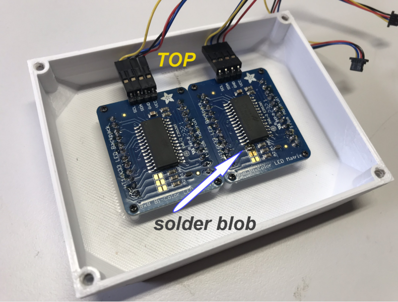
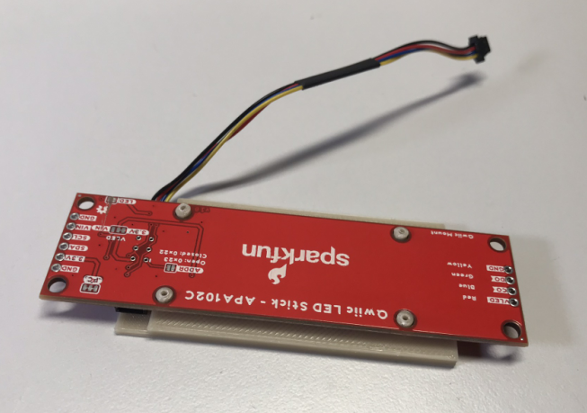
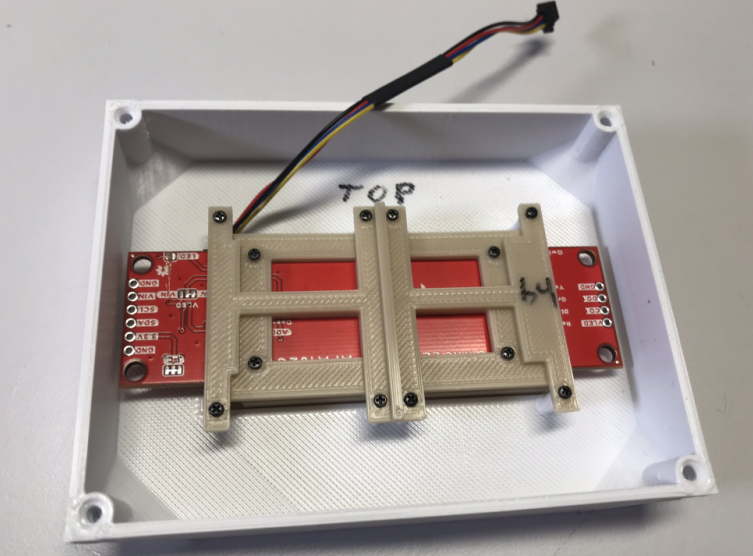
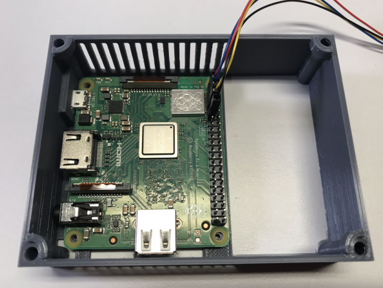
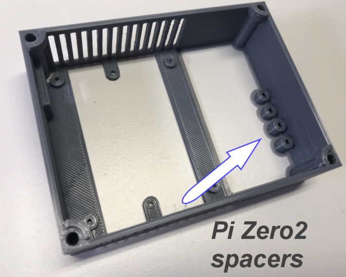
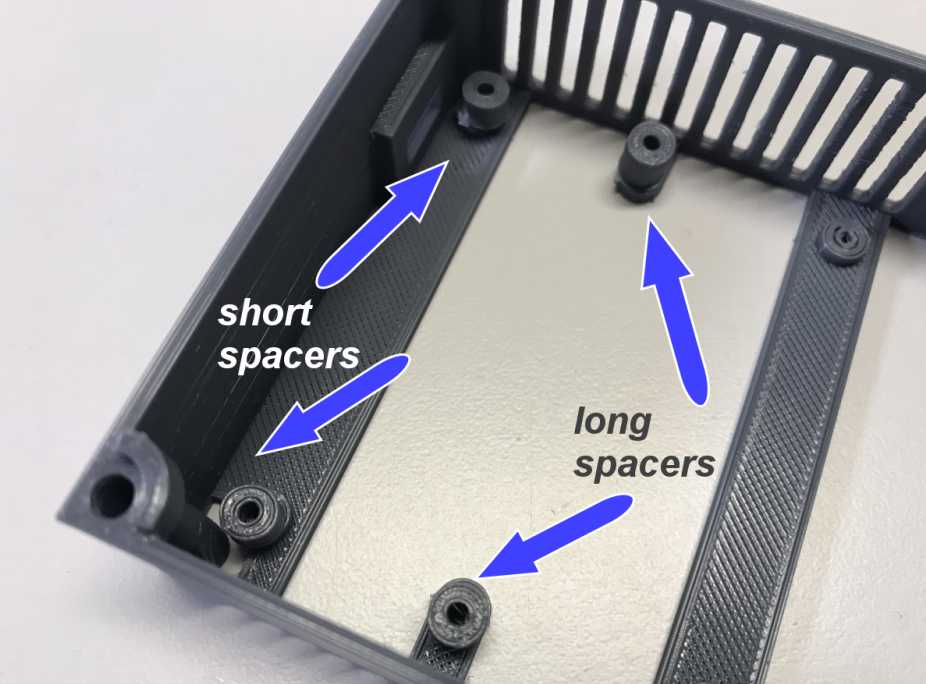
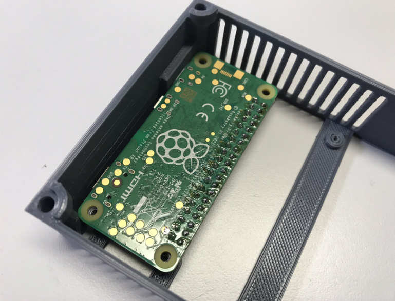
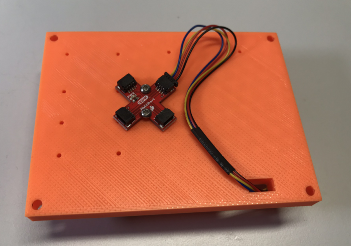
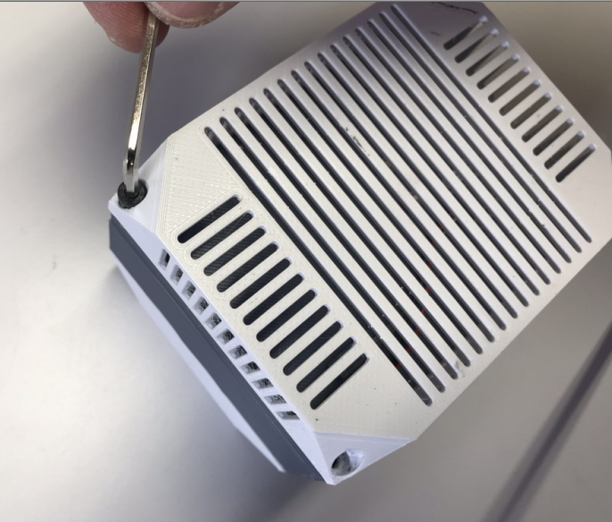
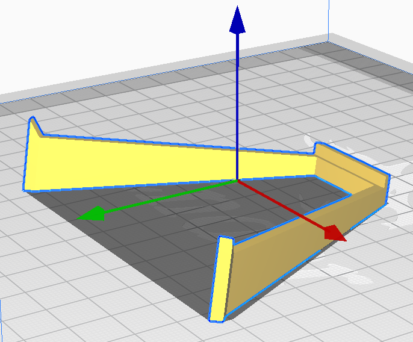

# 5. Case printing and assembly

The IAQ has a lovely and easy-to-print 3D case that fits the standard parts listed in the hardware list.

## Hardware required

To assemble the printed parts, you'll need the following:

- eight (8) M1.4 x 5mm self-tapping screws to mount the display (plus four more if using the LED bargraph)
- four (4) M2 x 6mm pan head screws for mounting the Pi 3A+ or four (4) M2 x 10mm screws for Pi Zero 2W
- two (2) M2 x 10mm pan head screws for mounting the multiport connector
- two to four (2 - 4) M2 x 12mm pan head screws to mount EACH sensor (up to 10 screws total)
- four (4) M3 x 40mm hex socket head screws to secure the case

The screw lengths specified above for the M2 screws are minimum values. Somewhat longer screws can always be used instead; shorter screws may not work well. In a pinch, #2 screws of similar length may be substituted for the M2 screws although they may be a bit tight.

## Printing

The IAQ case consists of four pieces that can be printed using a standard consumer 3D printer. The files for printing these pieces are in the `stl` folder.

We have tested these pieces by slicing them using Ultimaker Cura 4.11; Each piece should be rotated 180 degrees for printing. We used an infill density of 20%, which the printing characteristics below are based on.

## Front piece

The front panel holds the LED/backpack assemblies. Each assembly sits on a set of four posts. Use M1.4 x 5mm screws to secure the displays to the posts. The backpack that is set to the 0x71 address by the solder pad blob should be on the right when looking at the back of the face plate. The angled headers should face upwards towards the top of the front piece. (At this point, you can establish which orientation is the top, as the sides are both the same.) TIP: attach the female wire headers before inserting the displays onto the posts.

Printing tips: Note that the first layer is only one layer thick for the display window portion of the front piece. Since that adds a lot of surface area on the bed, you can probably get by with a skirt instead of a brim for this part. We suggest printing this piece in some version of white so that the window does not interfere with the LED colors. (Our standard has been to print the front and back in white, and the middle pieces in a contrasting color such as orange.) Typical printing characteristsics: 28g/9.4m of filament; 4:06 print time.

### LED Bargraph
If you are using the LED bargraph, also print the `bargraph-bracket-front.stl` and `bargraph-bracket-back.stl` pieces. Start by laying the front bracket piece (with the square cutouts) flat with the posts facing up and the indented area on the left. Then place the Qwiic Stick upside down onto the four posts as shown below:

Next, place the back bracket piece on top of the four posts fron the front piece, lining up the four holes. Note that the wider side of the back bracket (with the black marker in the image below) should be on the right. Use four M1.4 x 5mm self-tapping screws to secure the two parts of the bracket together with the Qwiic Stick in between.

Now use eight M1.4 x 5mm self-tapping screws to attach the bracket assembly to the front case piece, noting the orientation shown below:

## Pi Ring
The `pi_ring` holds the Raspberry Pi 3A+ or Zero 2 W in place. 

### Pi 3A+
Use four #2-56 pan head screws 5/16" long to mount the Pi in the provided holes and secure with nuts oriented as shown below. Make sure the micro USB port lines up with the hole on the side of the pi ring.

### Pi Zero 2W
Note the four cylidrical spacers that print along the right wall of the part. These are used to properly mount a Pi Zero 2 W - you can ignore or discard them if using a Pi 3A+. 

To mount a Zero 2 W, remove the spacers and place them on the screw holes as shown below. The short spacers go closest to the wall with the hole, while the longer spacers go on the two midway tabs.

Mount the Pi Zero 2 inverted onto the spacers as shown below and secure with longer screws and nuts.

Printing tips: This piece does not have a lot of bed surface area, so a brim is recommended. Printing characteristics: 27g/9.04m of filament; 5:15 print time.

## Insulate sense
The `insulate_sense` piece is used to mount the sensors and insulate them from the heat of the Pi. There is a small opening at the bottom of this piece to feed a Qwiic connector and cable through to the other side to attach to the first sensor (usually the particulate unit). The side opposite the sensor mounts has two holes to attach the Qwiic multiport connector with #2-56 1/2" pan head screws and nuts.

There are mounting holes in the posts for all sensors. You can use two, three, or four #2-56 5/32" pan head screws to attach each sensor. For extra stability, use one or more 5/8" screw with a nut on the other end per sensor. The bottom of the particulate sensor "sits" on a small shelf. TIP: Tape the blue part of the particulate sensor to the circuit board with a small amount of electrical tape to keep it from sliding around. (Make sure not to cover any of the venting holes on the right of the sensor though!) You can daisy chain the sensors together using various length Qwiic connector cables. The image below shows the location for each sensor:

Printing tips: This piece has a good amount of surface area on the bed, so a skirt may be sufficient. Printing characteristics: 31g/10.36m of filament; 3:42 print time.

## Back
The back of the unit provides protection and airflow for the sensors. All four pieces are held together by inserting four M3 x 40mm hex socket head screws through the back piece and attaching to the screw holes in the front piece. These screws should not thread into any piece other than the front - they should move freely until they hit the holes in the front. Since the front three pieces are interlocking, you can sandwich them together (being careful not to crimp any wires!) before placing the back piece on. You may need to start the threading on the front piece by inserting a small wood screw and rotating it a few turns.

Printing tips: This piece has a limited amount of bed surface area, so a brim is recommended. In addition, you should enable the "generate support" option for placement "everywhere" and a support overhang angle of "45". Printing characteristics: 25g/8.44m of filament; 5:09 print time.

## stand

The optional stand is a small angled platform for your IAQ device to sit on, which tilts it slightly upward for an improved viewing angle. When slicing this piece, it's best to rotate it forward 90 degrees and then select your "lay flat" option. Using a brim is also recommended.

